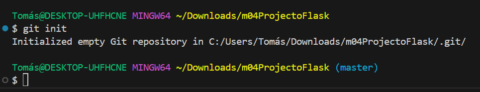

# Pasos per configurar la aplicacio Flask

1. [Configuracio inicial al local i Creacio del repositori](#configuracio-inicial-al-local-i-creacio-del-repositori)
2. [Instalacio de Flask al entorn local](#instalacio-de-flask-al-entorn-local)
3. [Primer commit](#primer-commit)
4. [Integracio de repositori amb Visual Studio Code](#integracio-de-repositori-amb-visual-studio-code)

## Configuracio inicial al local i Creacio del repositori

## Instalacio de Flask al entorn local

## Primer commit

## Integracio de repositori amb Visual Studio Code

